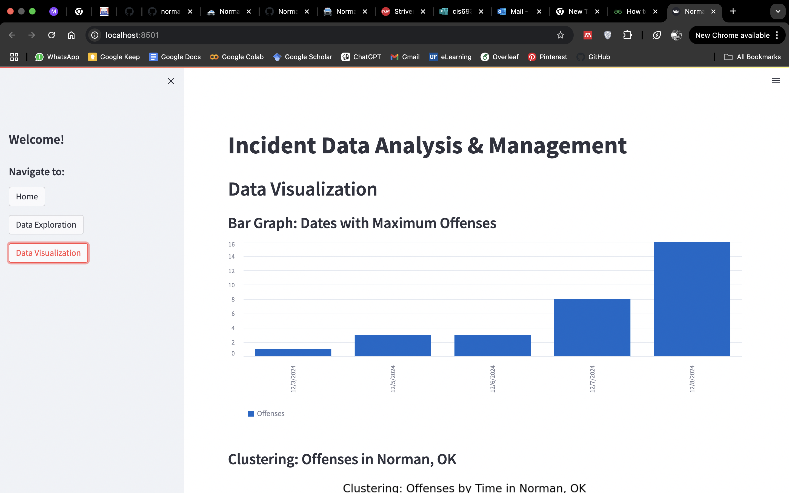

# cis6930fa24 -- Project 3

Name: Rishika Sharma
UFID: 32772571

# Assignment Description 

The project aims to manage public safety by noting all the incidents in the area. The project takes the PDF files and extracts data from the coulmns which are not very uniform making it easy for someone to access the data more easily. This data is then fed to a SQLite database which makes query finding easy, so that arrests can be arranged or nested accordingly. This data is then displayed as an application using data-driven web-based tool **Streamlit** to analyze and visualize incident data from the Norman Police Department, Oklahoma. It enables users to extract, explore, and visualize insights from publicly available daily arrest summaries.

## How to install
```
pipenv install -e 
```

## How to run
```
pipenv run streamlit run src/app.py
```

## Video (Demo Walkthrough)

[](https://youtu.be/OMv0h6U75HI)

Click on the video to be redirected or [go here](https://youtu.be/OMv0h6U75HI).

## How to test
```
pipenv run python -m pytest 
```

## Functions

## **app.py**

**1. `Sidebar Navigation`**
- Allows users to navigate between the three main pages of the application.

**2. `Home Page`**
- Serves as the introduction page, providing guidance on the application's features and capabilities.

**3. `Data Exploration`**
- Allows users to fetch incident data from the Norman PD website and display it in a tabular format.
- A date input widget restricts data selection to the past month.
- Constructs the URL for the selected date and fetches the corresponding PDF.
- Uses the `extract` function from `utils/assignment0.py` to parse the PDF into a structured DataFrame.
- Displays the extracted data in an interactive table.

**4. `Data Visualization`**
- Provides graphical representations of the extracted data.
- `Bar Graph` displays dates with the maximum number of offenses. Uses Streamlit's `st.bar_chart` feature.
- `Clustering` shows offenses clustered by time. Uses Matplotlib scatter plot with color-coded offense counts.
- `Heatmap` visualizes offense trends across different times of the day. Uses Seaborn heatmap with a color bar for offense density.


## **utils/assignment0.py**

**1. `loadpdf(url)`**
- This function downloads a PDF from a given URL and saves it to the specified path.
- `url` and `file` (str) are parameters for URL of the PDF to be downloaded.
- A header is constructed so that the request is not rejected, often non-header requests are blocked assuming they are automated bots. So we recreate a browser request instead for all OS types such as Windows, MacOS and Linux.
- Requests data using `urllib.request.urlopen()` which ensures the connection is securely opened and closed.
- The file path where the PDF was saved is returned.

**2. `extract(file_path)`**
- This function extracts incident records from a PDF and returns a list of dictionaries.
- The PDF is accessed using the `PdfReader` library.
- This function parses raw text into structured incident data, dynamically skipping the header.
- Uses `text` (str) as parameter for storing the raw text extracted from the PDF.
- Dynamically identifies the start of the data by checking for valid `incident_time` fields (e.g., containing `/` and `:`).
- Splits the text into fields and extracts:
  - `incident_time`
  - `incident_number`
  - `incident_location`
  - `nature`


## Workflow

1. User selects a date using the date picker.
2. Application constructs the appropriate URL for the daily arrest summary PDF.
3. The `loadpdf` function fetches the PDF file.
4. The `extract` function processes the PDF and extracts structured data.
5. The extracted data is displayed in a table.
6. The user navigates to the **Data Visualization** page.
7. If data is available, visualizations are generated:
   - **Bar Graph**: Plots the number of offenses by date.
   - **Clustering**: Displays a scatter plot of offenses grouped by time.
   - **Heatmap**: Shows offense trends across 24-hour time periods.


## Regex Used
```
re.match(r'(\d{1,2}/\d{1,2}/\d{4}) (\d{2}:\d{2})', row)
```
This regex is used to extract Date and Time in the following format:
- `Date:` MM/DD/YYYY or M/D/YYYY
- `Time:` HH:MM (24-hour format)

```
re.search(r'(\d{8})', row)
```
This regex is used to extract `Case Numbers`, which are 8-digit numeric strings

## Error Handling

`PDF Download Errors`
- Catches and logs HTTP errors using:
  ```python
  except urllib.error.HTTPError as e:
      st.error(f"Failed to fetch data from {url} - HTTP Error: {e}")
  ```

`Data Extraction Errors`
- Ensures that critical fields (`Date`, `Time`, `Case Number`) are always present using:
  ```python
  df.dropna(subset=['Date', 'Time', 'Case Number'], inplace=True)
  ```

`Empty Dataframe`
- Provides user feedback if no data is extracted:
  ```python
  if st.session_state["extracted_data"].empty:
      st.warning("No data extracted yet! Go to 'Data Exploration' first.")
  ```

## Testing
**`1. test_invalid`**
- To test the behavior of the loadpdf function when given an invalid URL.
- Uses pytest-mock to mock the `urllib.request.urlopen` function, making it raise an exception.
- Calls loadpdf with an invalid URL.
- The test passes if loadpdf returns `None` when an invalid URL is provided.

**`2. test_extract`**
- To test the extract function using a real PDF file (`test.pdf`).
- Opens the local test.pdf file in binary mode and reads its content into a BytesIO object.
- Passes the BytesIO object to the extract function.
- The test passes if: The file exists, is readable and the function returns a non-empty DataFrame.


## Bugs and Assumptions
- The program assumes extracted data will have the exact column names (Date, Time, Case Number, Arrest Location, Offense) and data types as expected.
- `pypdf` library uses certain internal features that have not been updated to be fully compatible with Python 3.12. For example, `Protocol` feature within `typing` library. Since `PyPDF2` is deprecated but still functional, it was chosen as a temporary solution to maintain PDF parsing functionality in Python 3.12 environments. 
```bash
pip install PyPDF2
